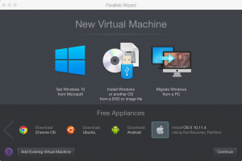
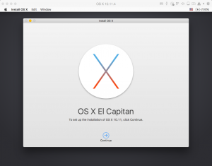

Creating an OS X Base Box for Vagrant with Parallels
#####################################################
:id: 4
:date: 2016-03-25 21:11
:author: aidanharris
:category: Apple, DevOps, OS X, Parallels, Vagrant, Virtualisation
:slug: creating-an-os-x-base-box-for-vagrant-with-parallels
:status: published
:headingIconFont: fa fa-apple
:beforeHeading: &nbsp;

Introduction
^^^^^^^^^^^^

Vagrant is a useful tool for managing virtual machines. It can be used
for setting up development and testing environments. This means code can
be built and tested in a clean and consistent environment.

Prerequisites
^^^^^^^^^^^^^

-  A Mac Computer - I'm using a MacBook Pro Retina 15" Late 2013 model
   running OS X El Capitan (10.11.4) but this tutorial is likely to work
   for any version of OS X that is compatible with parallels and
   vagrant.
-  `Vagrant <https://vagrantup.com>`__
-  `Parallels <https://www.parallels.com>`__
-  `vagrant-parallels <https://github.com/Parallels/vagrant-parallels>`__
   (install it with vagrant;
   ``vagrant plugin install vagrant-parallels``)

Step 1 - Creating & Tuning VM Configuration
^^^^^^^^^^^^^^^^^^^^^^^^^^^^^^^^^^^^^^^^^^^

.. raw:: html

   <figure>

|Screenshot of the Parallels Virtual Machine creation.|

.. raw:: html

   </figure>

After selecting the "Install OS X x.x.x Using the Recovery Partition"
option, Parallels will immediately boot the VM. Shut it down so we can
make some adjustments to the VM.

Key things you might want to alter are the RAM, number of processors and
hard disk drive storage space. For my virtual machine I bumped the RAM
up to 4GB, changed the number of processors to 4 and changed the hard
disk size to 2TB. Most of these things can be altered later should you
need to.

Step 2 - Installing OS X
^^^^^^^^^^^^^^^^^^^^^^^^

.. raw:: html

   <figure>

|Screenshot taken from the OS X El Capitan installation.|

.. raw:: html

   </figure>

After altering the VM to your liking, proceed with the OS X installation
as you normally would ensuring that your username and password are both
set to 'vagrant'.

Step 3 - Installing Software Updates
^^^^^^^^^^^^^^^^^^^^^^^^^^^^^^^^^^^^

Install any software updates using
``sudo softwareupdate --install --all`` or the AppStore.

Step 4 - Installing Parallels Tools
^^^^^^^^^^^^^^^^^^^^^^^^^^^^^^^^^^^

Install Parallels Tools

Step 5 - Disabling Firewall
^^^^^^^^^^^^^^^^^^^^^^^^^^^

Ensure that the firewall is disabled (go to "System Preferences" -->
"Security & Privacy" --> "Firewall")

.. raw:: html

  <h4>

  Step 6 - Enabling Remote Login

.. raw:: html

  </h4>

Enable "Remote Login" (go to "System Preferences" --> "Sharing" --> Make
sure "Remote Login" is checked for all users)

.. raw:: html

  <h4>

  Step 7 - Downloading SSH Key Used for Authentication

.. raw:: html

  </h4>

Download the vagrant insecure ssh key which is used to obtain authorised
access to the box:

::

    mkdir -p /Users/vagrant/.ssh
    chmod 0700 /Users/vagrant/.ssh
    curl -o /Users/vagrant/.ssh/authorized_keys --url https://raw.githubusercontent.com/mitchellh/vagrant/master/keys/vagrant.pub
    chmod 0600 /Users/vagrant/.ssh/authorized_keys
    chown -R vagrant /Users/vagrant/.ssh

Step 8 - Setting up password-less \`sudo\` access
^^^^^^^^^^^^^^^^^^^^^^^^^^^^^^^^^^^^^^^^^^^^^^^^^

Set up password-less \`sudo\` access:

``sudo visudo``

Add or modify the following lines as necessary:

::

    Defaults env_keep += 'SSH_AUTH_SOCK'
    Defaults:vagrant !requiretty

    # Add the vagrant user at the end of the file
    vagrant ALL=NOPASSWD:ALL

Step 9 - Installing Software Necessary for Provisioning
^^^^^^^^^^^^^^^^^^^^^^^^^^^^^^^^^^^^^^^^^^^^^^^^^^^^^^^

Install the bare minimum needed to provision a VM e.g.
`Xcode <https://developer.apple.com/xcode/>`__,
`Homebrew <http://brew.sh>`__ and `Chef <https://www.chef.io/>`__.

Step 10 - Optimising the VM
^^^^^^^^^^^^^^^^^^^^^^^^^^^

You can zero out free space using ``diskutil`` as follows:

::

    diskutil secureErase freespace 0 Macintosh HD

Doing the above produced some errors but YMMV.

After the above is done you can power off the VM (``sudo halt``) and
compress the HDD using Parallels as follows:

::

    prl_disk_tool compact --hdd /path/to/harddisk.hdd

Step 11 - Packaging the VM
^^^^^^^^^^^^^^^^^^^^^^^^^^

Create metadata.json file inside parallels .pvm file (this is probably in ~/Documents/Parallels/):
''''''''''''''''''''''''''''''''''''''''''''''''''''''''''''''''''''''''''''''''''''''''''''''''''

The metadata.json file should look as follows:

::

    {"provider": "parallels"}

After you've done the above you can then package the box using the
following command:

::

    tar cvzf elcapitan64.box ./OS\ X\ 10.11.4.pvm ./metadata.json

After this is done you can instruct Vagrant to add as an available box
as follows:

::

    vagrant box add elcapitan64 elcapitan64.box

In a new directory you can then run ``vagrant init elcapitan64`` and
bring the machine up with ``vagrant up``

If Vagrant has issues authenticating with the box over SSH refer to the
following `StackOverflow
question <http://stackoverflow.com/questions/22922891/vagrant-ssh-authentication-failure>`__.

Acknowledgment
^^^^^^^^^^^^^^

A special thanks goes to `Ryan
Skoblenick <https://www.skoblenick.com/vagrant/vmware-fusion/creating-an-osx-base-box/>`__
who greatly influenced this tutorial.

Parallels also provides some helpful information on creating base boxes
`here <http://parallels.github.io/vagrant-parallels/docs/boxes/base.html>`__.

Automation
^^^^^^^^^^

It should be possible to automate a lot of the above (perhaps by using
`Packer <https://www.packer.io>`__?), something I'll be investigating
further in the future.

